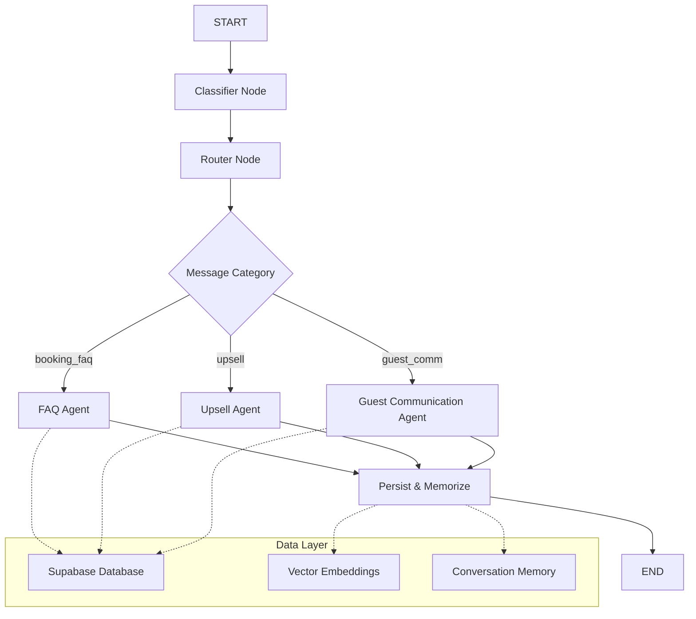

# Atlantis LangGraph Hotel Assistant

A sophisticated conversational AI assistant for hotels built with LangGraph, LangChain, and Supabase. This multi-agent system intelligently handles guest interactions across booking inquiries, upselling opportunities, and general communication while maintaining conversation history and personalized recommendations.

## Architecture



## Core Features

### 🎯 Intelligent Classification
- **Automatic Intent Detection**: Categorizes messages into `booking_faq`, `upsell`, or `guest_comm`
- **Context-Aware Routing**: Directs conversations to specialized agents based on guest intent

### 📚 Multi-Layer FAQ System
- **Direct Matching**: Fast fuzzy text matching against FAQ entries
- **Vector Search**: Semantic similarity search using sentence transformers
- **LLM Fallback**: Claude-powered responses for complex queries

### 💰 Smart Upselling
- **Personalized Recommendations**: Property-specific upsell suggestions
- **Budget-Aware Filtering**: Respects guest spending preferences
- **Recommendation Tracking**: Logs all suggestions to prevent duplicates

### 🗣️ Natural Conversation
- **Conversational Memory**: Maintains context across interactions
- **Embedding-Based Memory**: Stores conversation history with semantic search
- **Escalation Handling**: Recognizes when human intervention is needed

## Technology Stack

- **[LangGraph](https://github.com/langchain-ai/langgraph)**: Multi-agent conversation orchestration
- **[LangChain](https://github.com/langchain-ai/langchain)**: LLM integration and chains
- **[Supabase](https://supabase.com/)**: Database, authentication, and vector storage
- **[Anthropic Claude 3.5 Sonnet](https://www.anthropic.com/claude)**: Primary language model
- **[Sentence Transformers](https://www.sbert.net/)**: Local embedding generation (`all-MiniLM-L6-v2`)

## Quick Start

### Prerequisites

- Python 3.9+
- [uv](https://github.com/astral-sh/uv) (recommended) or pip
- Supabase project with appropriate schema
- Anthropic API key

### Installation

```bash
git clone https://github.com/your-username/atlantis-langgraph.git
cd atlantis-langgraph

# Using uv (recommended)
uv sync

# Or using pip
pip install -e .
```

### Environment Setup

Create a `.env` file in the project root:

```bash
# Required
ANTHROPIC_API_KEY=your_anthropic_api_key_here
SUPABASE_URL=your_supabase_project_url
SUPABASE_SERVICE_KEY=your_supabase_service_role_key

# Optional: For read-only operations
SUPABASE_ANON_KEY=your_supabase_anon_key
```

### Database Schema

The application expects these Supabase tables:

```sql
-- FAQ entries with vector embeddings
CREATE TABLE faq_entries (
    id UUID PRIMARY KEY DEFAULT gen_random_uuid(),
    property_id UUID NOT NULL,
    question TEXT NOT NULL,
    answer TEXT NOT NULL,
    embedding VECTOR(384),
    created_at TIMESTAMP DEFAULT NOW()
);

-- Upsell items with embeddings
CREATE TABLE upsell_items (
    id UUID PRIMARY KEY DEFAULT gen_random_uuid(),
    property_id UUID NOT NULL,
    name TEXT NOT NULL,
    description TEXT,
    price_cents INTEGER,
    is_active BOOLEAN DEFAULT TRUE,
    embedding VECTOR(384),
    created_at TIMESTAMP DEFAULT NOW()
);

-- Conversation tracking
CREATE TABLE messages (
    id UUID PRIMARY KEY DEFAULT gen_random_uuid(),
    conversation_id UUID NOT NULL,
    author_id UUID,
    author_type TEXT NOT NULL, -- 'guest' or 'assistant'
    guest_id UUID NOT NULL,
    body TEXT NOT NULL,
    embedding VECTOR(384),
    created_at TIMESTAMP DEFAULT NOW()
);

-- AI conversation memory
CREATE TABLE ai_conversation_memory (
    id UUID PRIMARY KEY DEFAULT gen_random_uuid(),
    conversation_id UUID NOT NULL,
    role TEXT NOT NULL,
    content TEXT NOT NULL,
    embedding VECTOR(384),
    created_at TIMESTAMP DEFAULT NOW()
);

-- Upsell recommendation tracking
CREATE TABLE upsell_recommendations (
    id UUID PRIMARY KEY DEFAULT gen_random_uuid(),
    reservation_id UUID NOT NULL,
    guest_id UUID NOT NULL,
    upsell_item_id UUID NOT NULL,
    suggested_by TEXT DEFAULT 'ai_agent',
    status TEXT DEFAULT 'suggested',
    metadata JSONB DEFAULT '{}',
    created_at TIMESTAMP DEFAULT NOW()
);
```

### Required Database Functions

```sql
-- Vector similarity search for FAQ
CREATE OR REPLACE FUNCTION match_faq(
    query TEXT,
    prop_id UUID,
    top_n INTEGER DEFAULT 5
) RETURNS TABLE(content TEXT, similarity FLOAT) AS $$
BEGIN
    RETURN QUERY
    SELECT 
        faq_entries.answer,
        1 - (faq_entries.embedding <=> embedding(query)) as similarity
    FROM faq_entries
    WHERE property_id = prop_id
    ORDER BY similarity DESC
    LIMIT top_n;
END;
$$ LANGUAGE plpgsql;

-- Vector similarity search using pre-computed embeddings
CREATE OR REPLACE FUNCTION match_faq_vec(
    q_vec VECTOR(384),
    prop_id UUID,
    top_n INTEGER DEFAULT 5
) RETURNS TABLE(content TEXT, similarity FLOAT) AS $$
BEGIN
    RETURN QUERY
    SELECT 
        faq_entries.answer,
        1 - (faq_entries.embedding <=> q_vec) as similarity
    FROM faq_entries
    WHERE property_id = prop_id
    ORDER BY similarity DESC
    LIMIT top_n;
END;
$$ LANGUAGE plpgsql;
```

## Usage

### Basic Conversation

```python
from main import run_chatbot

# Start a conversation
run_chatbot(
    reservation_id="your-reservation-id",
    guest_id="your-guest-id", 
    property_id="your-property-id"
)
```

### Embedding Management

To populate embeddings for existing data:

```bash
python backfill_embeddings.py
```

### Testing

The project includes comprehensive tests with mock data:

```bash
python test.py
```

## Project Structure

```
atlantis-langgraph/
├── main.py                 # Primary application with LangGraph workflow
├── test.py                 # Test suite with mock LLM and real Supabase
├── backfill_embeddings.py  # Utility for populating vector embeddings
├── pyproject.toml          # Project dependencies and metadata
├── uv.lock                 # Dependency lock file
└── README.md              # This file
```

## Key Components

### Agent Architecture

1. **Classifier**: Determines user intent from message content
2. **Router**: Directs conversation to appropriate specialist agent
3. **FAQ Agent**: Handles booking and policy questions with multi-layer search
4. **Upsell Agent**: Manages personalized recommendations and tracking
5. **Guest Communication Agent**: Handles general conversation and requests

### Memory System

- **Conversation Persistence**: All interactions stored in Supabase
- **Embedding Storage**: Vector representations for semantic search
- **Recommendation Tracking**: Prevents duplicate upsell suggestions

## Development

### Local Development

```bash
# Install development dependencies
uv sync --dev

# Run the assistant
python main.py

# Run tests
python test.py
```

### Adding New Features

1. **New Agent Types**: Add to the `MessageClassifier` schema and create corresponding node functions
2. **Enhanced Memory**: Extend the conversation memory system for more complex context
3. **Additional Integrations**: Add new data sources or external APIs through the Supabase layer

## Configuration

The system supports tenant-specific configuration through the `property_id` parameter, allowing:

- Property-specific FAQ databases
- Customized upsell catalogs
- Isolated conversation histories
- Tailored response styles

## Contributing

1. Fork the repository
2. Create a feature branch
3. Implement your changes with tests
4. Submit a pull request

## License

This project is licensed under the MIT License. See LICENSE file for details.

## Support

For questions or issues:
- Check the test suite for usage examples
- Review the Supabase schema requirements
- Ensure all environment variables are properly configured

---

*Built with ❤️ using LangGraph and Supabase*
